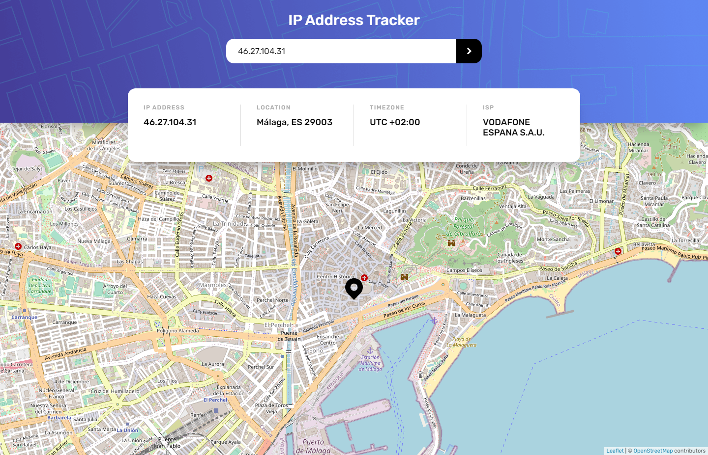
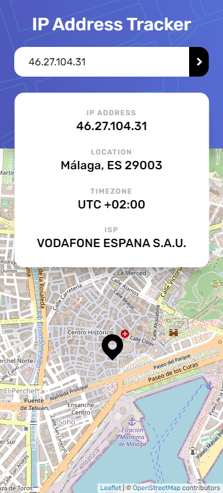

## Table of Contents

- [Overview](#overview)
  - [The Challenge](#the-challenge)
  - [Screenshot](#screenshot)
  - [Links](#links)
- [My Process](#my-process)
  - [Built With](#built-with)
- [Author](#author)

## Overview

### The challenge

Users should be able to:

- View the optimal layout for each page depending on their device's screen size
- See hover states for all interactive elements on the page
- See their own IP address on the map on the initial page load
- Search for any IP addresses or domains and see the key information and location

### Screenshot

## My process

### Built with

- Prettier
- JavaScript
- Clean Code
- API
- Flexbox
- CSS Grid
- Responsive
- [React](https://reactjs.org/) - JS library

### What I learned

Using IpAdress API and react-leaflet. I learned how to use react-leaflet and how to use the IpAdress API. I also learned how to use the fetch method to get the data from the API.